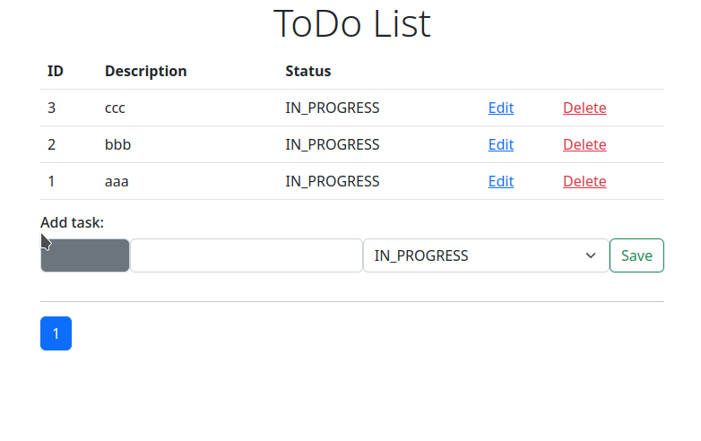
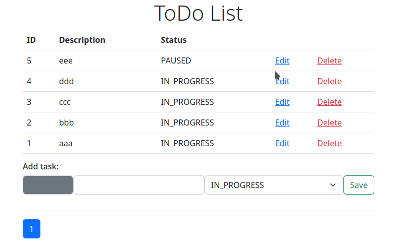
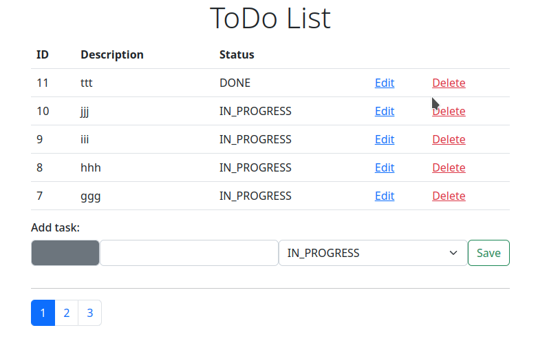

# Базовый функционал простого списка задач с использованием Spring Boot

Простой Todo List с возможностью добавлять, удалять и редактировать задачи.
Для удобства просмотра реализована пагинация.

## Демонстрация

### Добавление задачи
  

### Редактирование задачи
  

### Удаление задачи
  

## Локальный запуск

Для запуска достаточно из корня проекта выполнить команду:
```
bash start.sh
```
которая включает в себя последовательность команд:
```
mvn clean package
docker compose down
docker compose up --build
```

Приложение будет доступно по адресу:
```
http://localhost:8080/
```

## Технологический стек

- Maven
- Spring Boot
- PostgreSQL
- Flyway
- Docker
- Thymeleaf
- HTML/CSS/JS

## Лицензия

Apache License 2.0 - файл [LICENSE](LICENSE) для подробного просмотра